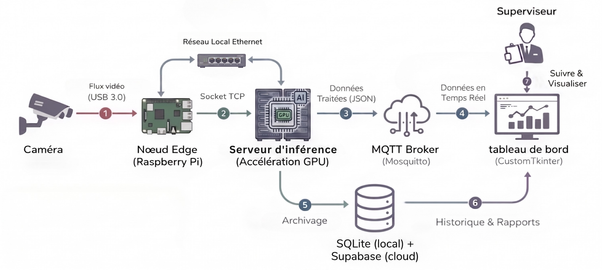
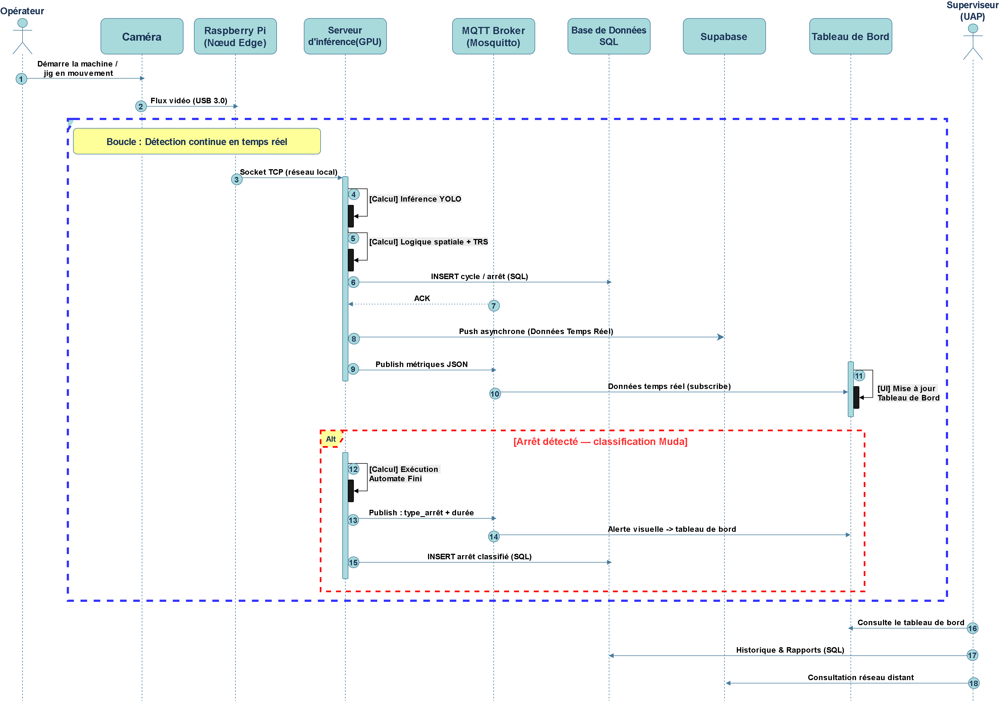
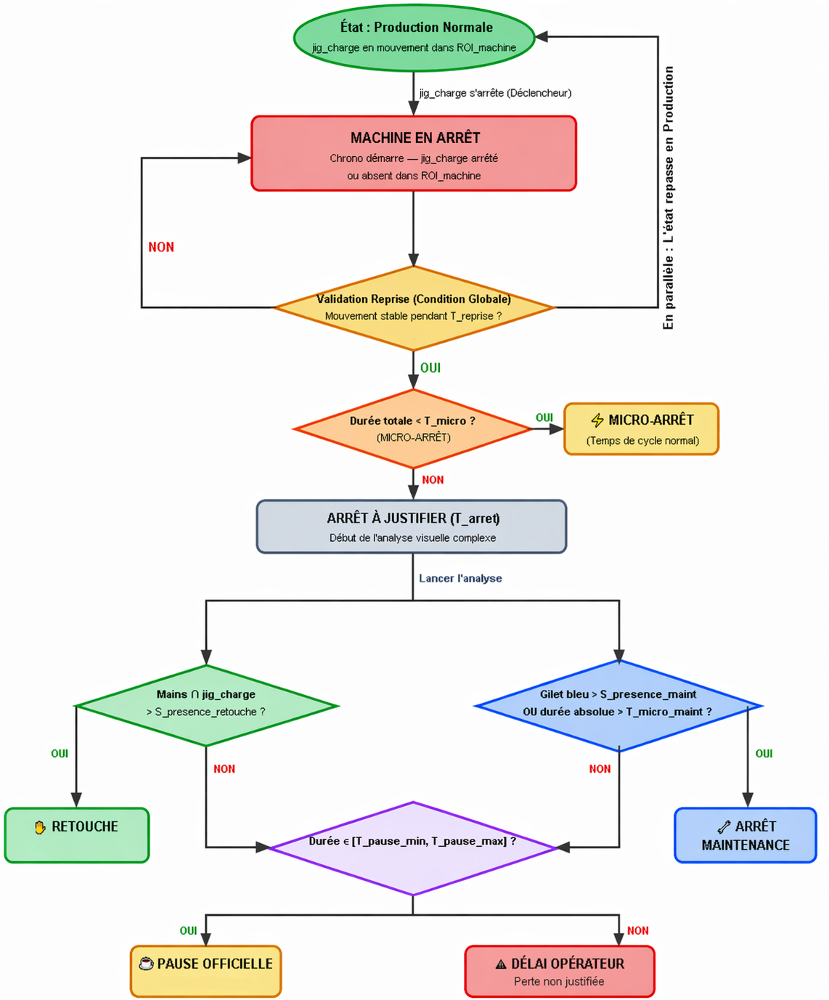

# SMART Productivity Monitor 🚀
> **Real-Time Edge AI & Lean Manufacturing Analytics for FORVIA (STEA)**

[](https://www.python.org/downloads/)
[](https://github.com/ultralytics/ultralytics)
[](https://github.com/TomSchimansky/CustomTkinter)
[](https://supabase.com)

🎥 **[Watch the Live System Demonstration on LinkedIn](https://www.linkedin.com/posts/abdessalem-anis-23b497377_artificialintelligence-computervision-forvia-ugcPost-7474089099726053376-F1fr/)**

---

## 📌 Project Overview
The **SMART Productivity Monitor** is an industrial Edge AI computer vision and analytics platform developed for **FORVIA Ben Arous (STEA)**. It automates overall equipment effectiveness (**OEE**) monitoring and identifies Lean Manufacturing **Mudas (waste)** on sewing production lines. 

By tracking the operator, the Juki sewing jig, and maintenance activities via real-time camera feeds, the system automatically classifies downtime reasons, counts finished pieces (OK/Scrap), tracks rework, and calculates real-time productivity statistics.

---

## 🏗️ System Architecture
The system uses a decoupled, hybrid architecture to balance heavy neural network processing with a lightweight, responsive operator user interface.

### Network & Data Flow Architecture


### Edge Computing Deployment Diagram


### System Sequence Diagram


1. **The Vision Loop (Edge AI - `vision_loop.py`)**: A headless, high-performance module executing YOLO26 object detection on camera streams. It detects hands, tools, sewing jigs, and operator status to feed the Muda state machine.
2. **The Dashboard (Operator GUI - `Dashboard/main.py`)**: An interactive GUI built with **CustomTkinter** that retrieves event logs, tracks daily shift statistics, displays real-time OEE, and allows supervisor configuration.

---

## 🧠 Lean Muda Classification Logic (`logique_mudas.py`)
Rather than relying on operator manual inputs, a **Finite State Machine (FSM)** handles real-time classification using the **60% presence rule** and temporal hysteresis:



*   **Normal Cycle (Production)**: The Juki sewing jig is in place and active movement is detected.
*   **Micro-Stop**: Machine halts briefly (<35 seconds) without operator departure.
*   **Rework (Retouche)**: Jig is stopped and operator's hands are detected in the active zone for $\ge 60\%$ of the downtime.
*   **Maintenance**: Blue vest/maintenance technician presence is detected on the line ($\ge 35\%$ of stop duration or $>300$ seconds absolute). Includes a 10-second run validation.
*   **Operator Delay (Attente Opérateur)**: Stop $>35$ seconds and $\le 20$ minutes with no maintenance or rework flags.
*   **Official Pause (Pause Officielle)**: Downtime between 20 and 30 minutes.
*   **Idle Time**: Unplanned stop exceeding 30 minutes (operator abandoned the workstation).

---

## 📁 Repository Structure
```bash
├── Dashboard/                  # CustomTkinter Interface UI
│   ├── assets/                 # Icons, logo images, and UI visuals
│   ├── ui/                     # UI components, layouts, and colors
│   ├── config.py               # Settings and DB connection parameters
│   ├── data_service.py         # SQL database queries and API bindings
│   ├── oee_calculator.py       # Live OEE formulas (Availability, Performance, Quality)
│   ├── shift_manager.py        # Shift timings and scheduler
│   └── main.py                 # Dashboard entry point
├── development_archive/        # Benchmark scripts, CUDA tests, and migration files
├── logics/
│   └── logique_mudas.py        # FSM state machine and classification thresholds
├── docs/
│   └── images/                 # Architecture and flowchart diagrams
├── camera_node.py              # Raspberry Pi Edge Camera Node (streams JPEG over TCP)
├── data_pipeline.py            # SQLite event logger and data persistence
├── vision_loop.py              # Real-time computer vision frame loops
├── run_startup.bat             # Industrial batch launcher for windows startups
├── .gitignore                  # GitHub ignore patterns (excludes models, db, & videos)
└── .env.example                # Template for environment variables (Supabase credentials)
```

---

## 🚀 Getting Started

### 1. Prerequisites
*   **Python 3.11+** installed.
*   **CUDA Toolkit** (Optional, recommended for GPU acceleration).
*   **Git** installed.

### 2. Installation
Clone the repository and navigate to your project directory:
```bash
git clone https://github.com/Ins1ant4/lean-muda-vision.git
cd lean-muda-vision
```

Create a virtual environment and install dependencies:
```bash
python -m venv venv
source venv/Scripts/activate  # On Windows: venv\Scripts\activate
pip install -r requirements.txt
```
*(Make sure to create a `requirements.txt` listing packages like `ultralytics`, `opencv-python`, `customtkinter`, `numpy`, etc.)*

### 3. Environment Setup
Copy the example environment file and fill in your Supabase cloud credentials or local database paths:
```bash
cp .env.example .env
```

---

## 🖥️ Running the Application

### Running Locally (Development Mode)
You can launch both modules simultaneously or run them separately:

*   **Launch the AI Vision Brain**:
    ```bash
    python vision_loop.py
    ```
*   **Launch the Operator Dashboard**:
    ```bash
    python Dashboard/main.py
    ```

### Industrial Startup (Production Mode)
Double-click `run_startup.bat` at the root directory to initiate the automatic sequence (verifying database connectivity, running camera tests, launching the vision module, and opening the CustomTkinter GUI in full-screen mode).

---

## 📡 Raspberry Pi Client Node Setup (`camera_node.py`)
To enable remote streaming from the sewing workstation to the processing unit:

1. **Physical Setup**: Mount a Raspberry Pi with a Pi Camera Module (or USB Webcam) pointing at the Juki sewing machine workspace.
2. **Network Connection**: Connect the Raspberry Pi and the main Windows laptop/Edge PC to the same local network (e.g., via mobile hotspot or workshop router).
3. **Configure the IP Address**:
   * Find the Windows laptop's IP address on the network (e.g., `192.168.137.1`).
   * Open [camera_node.py](file:///c:/Users/pc/OneDrive/Bureau/VISION_AB/camera_node.py) and update the `host_ip` field at line 14:
     ```python
     host_ip = 'YOUR_LAPTOP_IP'  # e.g., '192.168.137.1'
     ```
4. **Run the Camera Node**:
   Run the following on the Raspberry Pi terminal:
   ```bash
   python camera_node.py
   ```
   *The Pi will wait for the central laptop to launch the `vision_loop.py` socket server, and then automatically stream real-time JPEG-compressed frames. JPEG encoding reduces the bandwidth overhead from ~80 MB/s (raw) to ~1.5 MB/s (50x reduction), ensuring low-latency processing over Wi-Fi.*

---

## 📦 Deployment Strategy
*   **Dashboard**: Compiled with **PyInstaller** to yield a standalone `.exe` distributed to PCs in the workshop. Heavily trimmed down (by excluding `torch` and `ultralytics`) to keep the dashboard lightweight.
*   **Vision Loop**: Containerized using **Docker** for production rollouts on edge computers (e.g. Nvidia Jetson) running Linux, fetching streams from RTSP cameras over the local network.
