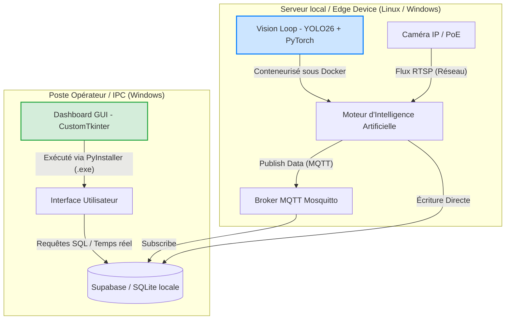

# Comparative Analysis: PyInstaller vs. Docker for the SMART Productivity Monitor

Ce document présente une analyse comparative détaillée entre **PyInstaller** et **Docker** dans le contexte du projet **SMART Productivity Monitor** développé pour **FORVIA Ben Arous (STEA)**. L'objectif est de vous fournir une justification technique rigoureuse à intégrer dans votre rapport de PFE (Chapitre 3 / Perspectives) et à présenter lors de votre soutenance.

---

## 1. Contexte du Projet & Architecture

Le système **SMART Productivity Monitor** présente une architecture découplée en deux sous-systèmes distincts :
1. **Le Vision Loop (Cerveau IA - `vision_loop.py`)** : Traitement lourd en temps réel (YOLO26, PyTorch, OpenCV, CUDA pour l'accélération GPU).
2. **Le Dashboard (Interface UI - `Dashboard/main.py`)** : Interface graphique interactive développée avec **CustomTkinter** pour les opérateurs et superviseurs.

Cette structure asymétrique impose des contraintes de déploiement très différentes pour chaque partie.

---

## 2. Analyse Détaillée de PyInstaller

**PyInstaller** compile le code Python et ses dépendances sous forme d'exécutable autonome (ex: un dossier contenant un `.exe` sous Windows ou un binaire sous Linux).

### Avantages pour le projet
* **Idéal pour l'Interface Graphique (CustomTkinter) :** Le Dashboard s'exécute nativement sur le système d'exploitation de l'opérateur (Windows). L'interface s'ouvre instantanément dans une fenêtre native sans surcouche ni configuration réseau complexe.
* **Déploiement "Zero-Prerequisite" en Atelier :** Pour installer le Dashboard sur le poste d'un superviseur ou d'un responsable d'UAP, il suffit de copier le dossier généré par PyInstaller. Aucun logiciel tiers (comme Docker Desktop) n'est nécessaire.
* **Ajustement de la Taille (Lightweight Dashboard) :** Comme le montre votre fichier [main.spec](file:///c:/Users/pc/OneDrive/Bureau/VISION_AB/main.spec), vous excluez intelligemment les bibliothèques lourdes (`torch`, `ultralytics`, `cv2`, `pandas`) du package du Dashboard. Cela produit un exécutable très léger, rapide à démarrer et facile à mettre à jour.
* **Accès natif au matériel :** Pas besoin de configurer des redirections de ports ou de périphériques pour accéder au réseau local ou aux bases de données locales.

### Inconvénients majeurs
* **Instabilité pour le Vision Loop (IA/PyTorch/CUDA) :** Essayer d'empaqueter le module de vision avec PyInstaller est un défi extrêmement complexe (souvent découragé en production) :
  * **Taille gigantesque :** Inclure PyTorch, les runtimes CUDA et OpenCV génère un exécutable de plusieurs giga-octets (3 à 5 Go+).
  * **Dépendance aux drivers hôtes :** L'exécutable compilé reste dépendant de la version exacte des pilotes NVIDIA (`nvcuda.dll`) installés sur la machine cible. Si le pilote Windows de l'IPC de production est mis à jour, l'exécutable peut planter sans avertissement.
  * **Erreurs d'importation cachées :** Les frameworks de Deep Learning utilisent beaucoup d'importations dynamiques qui échouent souvent lors de la compilation PyInstaller sans l'ajout de dizaines de "hooks" manuels.
* **Dépendance à la Plateforme :** Un exécutable compilé sous Windows 11 ne fonctionnera pas sur un Raspberry Pi (Linux/Debian). Il faut recompiler le projet sur chaque plateforme cible.

---

## 3. Analyse Détaillée de Docker

**Docker** encapsule l'application et l'intégralité de son environnement d'exécution (OS de base, bibliothèques C++, pilotes CUDA de niveau utilisateur, Python et packages) dans un conteneur isolé et immuable.

### Avantages pour le projet
* **Environnement Cerveau IA Standardisé :** C'est la solution reine pour le **Vision Loop**. Docker garantit que la combinaison exacte de `Python 3.11 + PyTorch + CUDA 12.x + OpenCV` fonctionnera à 100% sur n'importe quelle machine hôte (PC industriel de l'usine, serveur central, ou module Nvidia Jetson).
* **Isolation et Portabilité Totale :** Le conteneur s'exécute de la même manière sur le PC de développement et sur le PC de production de l'usine FORVIA, éliminant le syndrome du *"ça marche sur ma machine"*.
* **Gestion Robuste du GPU via NVIDIA Container Toolkit :** Permet de lier directement le GPU de la machine hôte au conteneur de manière sécurisée et isolée, tout en figeant les dépendances CUDA internes.
* **Gestion Industrielle des Processus (DevOps) :** Docker gère nativement le redémarrage automatique en cas de crash (politique `--restart unless-stopped`), la rotation des logs (pour éviter de saturer le disque de l'IPC) et les vérifications d'état (Healthchecks).
* **Prêt pour la Scalabilité (Industrie 4.0) :** Si FORVIA décide de déployer ce système sur 50 lignes de couture à travers plusieurs usines, les conteneurs peuvent être orchestrés de manière centralisée via **Kubernetes** ou **Docker Swarm**.

### Inconvénients majeurs
* **Complexité d'affichage des GUI (CustomTkinter) :** Faire tourner une application graphique Python (Tkinter) dans un conteneur Docker sous Windows est extrêmement difficile et peu performant :
  * Sous Windows, Docker fonctionne dans une machine virtuelle WSL2. Exporter l'affichage graphique du conteneur vers l'écran physique Windows nécessite d'installer un serveur X11 (comme VcXsrv) sur la machine hôte ou d'activer le support WSLg, ce qui complique grandement le déploiement.
* **Accès complexe aux caméras USB (Webcams) :** Sous Windows, Docker (via WSL2) ne voit pas nativement les caméras USB branchées sur le PC. Il faut installer des utilitaires tiers comme `usbipd-win` pour transférer le flux USB vers la machine virtuelle Linux, ce qui introduit des points de défaillance inacceptables sur une ligne de production industrielle. (Note : Ce problème ne se pose pas sur Linux natif ou avec des caméras IP/PoE).
* **Contraintes IT en Usine :** L'installation de Docker Desktop sur des PC de production nécessite souvent des droits d'administration avancés, l'activation de la virtualisation dans le BIOS, et se heurte parfois aux politiques de sécurité strictes des départements informatiques (IT) industriels.

---

## 4. Tableau Comparatif Synthétique

| Critère d'évaluation | PyInstaller | Docker | Choix Optimal pour le Projet |
| :--- | :--- | :--- | :--- |
| **Type d'application** | Monolithique / Exécutable natif | Conteneurisé / Micro-service | **Dashboard :** PyInstaller **Vision Loop :** Docker / Venv |
| **Performance GUI (Tkinter)** | **Excellente** (Accès natif au moteur graphique OS) | **Médiocre** (Nécessite redirection X11/WSLg complexe) | **PyInstaller** (Dashboard natif) |
| **Gestion IA (PyTorch / GPU)** | **Difficile** (Compilations lourdes, pannes de pilotes GPU) | **Excellente** (CUDA encapsulé via Nvidia Docker) | **Docker** (Vision Loop isolé) |
| **Accès Caméras USB (Windows)** | **Direct** (via OpenCV natif `cv2.VideoCapture(0)`) | **Complexe** (Nécessite passerelle USB/WSL2 `usbipd`) | **PyInstaller** (ou script local) |
| **Portabilité Multi-OS** | Faible (1 compilation par OS) | **Maximale** (Le même conteneur tourne partout) | **Docker** (pour le backend) |
| **Mise en route Usine** | **Ultra-simple** (Double-clic sur le `.exe`) | **Complexe** (Dépend de Docker Desktop + BIOS + IT) | **PyInstaller** (pour l'interface opérateur) |

---

## 5. La Recommandation Stratégique : **L'Approche Hybride**

Au lieu de faire un choix binaire, l'architecture industrielle la plus robuste et moderne pour le **SMART Productivity Monitor** chez FORVIA est une **Architecture Hybride (Désolidarisée)** :

### Pourquoi cette architecture hybride est la meilleure ?

1. **Le Dashboard reste Natif et Léger (via PyInstaller) :**
   Le Dashboard CustomTkinter est compilé en `.exe` léger grâce à votre configuration d'exclusion dans le fichier `main.spec`. Il est distribué facilement aux superviseurs. Il récupère les données via Supabase ou MQTT de manière transparente, sans aucune contrainte Docker.
   
2. **Le Vision Loop est Conteneurisé (via Docker) ou exécuté en Environnement Dédié (Venv) :**
   Le traitement vidéo lourd tourne en arrière-plan (Headless). 
   * **Sur un PC Windows avec Caméra USB (Phase Actuelle) :** L'utilisation de votre script de lancement industriel [run_vision_only.bat](file:///c:/Users/pc/OneDrive/Bureau/VISION_AB/run_vision_only.bat) associé à un environnement virtuel Python (`venv`) local est la solution la plus simple et efficace pour contourner les blocages USB de Docker sur Windows.
   * **Sur des Caméras IP / Réseau (Phase Industrielle) :** Le passage à **Docker** devient le choix logique. Le flux vidéo passe par le réseau (RTSP). Le conteneur Docker contenant YOLO26 tourne en arrière-plan sur un serveur de l'usine ou sur un Edge Device (Nvidia Jetson) avec accès GPU direct, éliminant tout conflit de pilotes.

---

## 6. Comment Valoriser ce Choix dans votre Mémoire de PFE et Soutenance

Dans votre mémoire (partie Industrialisation) et vos diapositives de soutenance, présentez ce choix comme une **décision d'ingénierie pragmatique et évolutive** :

### 1. Argument de l'Existant (Phase de Prototypage / Validation Usine) :
> *"Pour la phase pilote sur le site STEA de Ben Arous, nous avons privilégié une approche native basée sur **PyInstaller** pour le Dashboard opérateur et un lanceur industriel résilient (`.bat` avec auto-restart) pour le Vision Loop. Ce choix garantit un déploiement instantané sur les PC Windows existants en atelier, sans heurter les restrictions de sécurité de l'IT industrielle concernant l'installation de Docker et en assurant un accès direct aux caméras USB sans latence."*

### 2. Argument de la Perspective Industrielle (Scale-up Multi-sites) :
> *"Dans une perspective de déploiement à grande échelle (Smart Factory / Industrie 4.0), la transition vers **Docker** est planifiée pour le sous-système de vision. En migrant le flux vidéo d'USB vers des caméras IP (PoE), le Vision Loop pourra être conteneurisé sous Docker. Cela permettra d'encapsuler les dépendances complexes de YOLO26/PyTorch, de s'affranchir des contraintes d'OS, et de centraliser la gestion du parc d'IA via des orchestrateurs comme **Kubernetes** sur l'infrastructure Cloud ou Edge du groupe FORVIA."*

Cet argumentaire montrera à votre jury (notamment votre encadrant académique et professionnel) que vous maîtrisez non seulement la théorie des modèles IA, mais aussi les **réalités opérationnelles, matérielles et informatiques (IT/OT)** du monde industriel.
